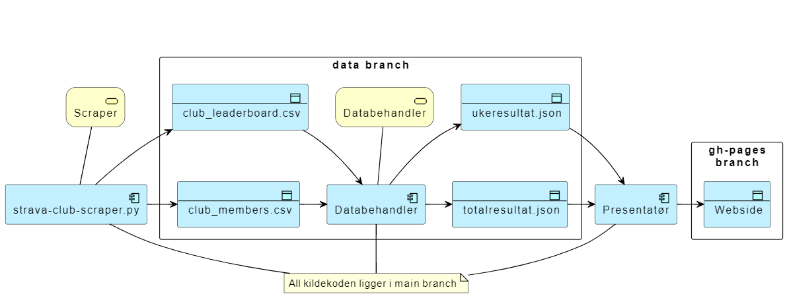

# Helsedirektoratet Strava scraper

Script og actions for å hente resultater fra Helsedirektoratet sin stravaklubb og publisere dette som resultatlister i forbindelse med sykle til jobben aksjonen.

## Arkitektur

## Komponenter

### Konfigurasjon

Konfigurasjon på tvers av python scriptene legges i [config.ini](https://github.com/hdir/strava-club/blob/main/settings/config.ini)  

### Strava club scraper

* **Trigger** Scraper startes av et [action script](https://github.com/hdir/strava-club/blob/main/.github/workflows/hdir-scrape.yaml), planen er at dette skal kjøre omtrent en gang om dagen, men akkurat nå startes dette manuelt.  
* Scraper applikasjonen er en fork av [strava club scraper](https://github.com/roboes/strava-club-scraper)
  * Forutsetter at det eksisterer en bruker som er medlem i Helsedirektoratet sin stravaklubb, passord og brukernavn ligger som hemmeligheter i repoet.  
  * Scraper koden er modifisert slik at output er csv filer istedenfor google sheets.
  * Scraper koden er modifisert slik at python scriptet kjører feilfritt i en Github Action.
  * Scraper koden er modifisert slik at brukernavn og passord ligger som hemmeligheter i repoet istedenfor som klartekst i config.ini.  
* Resultatet fra skraping legges [data\skrap](https://github.com/hdir/strava-club/blob/main/data/skrap)  

### Databehandler

Tar de siste CSV filene fra scraper og produserer tre resultatlister som json.
**Trigger** Nye eller oppdaterte CSV filer fra scraper. Kan muligens startes direkte fra [samme script som scraper](https://github.com/hdir/strava-club/blob/main/.github/workflows).

* En akkumulert resultatliste for en bestemt periode hvor resultatene for hele perioden akkumuleres.
  * En linje pr. deltaker med: akkumulert tid, akkumuldert kilometer tilbakelagt, akkumulert antall aktiviteter, akkumulert høydemeter tilbakelagt, ~~lengste distanse for en økt og gjennomsnittshastighet~~.
* En resultatliste for den siste uken.
* Et akkumulert resultat for hele klubben i hele perioden.
* Json resultatet legges [data\result](https://github.com/hdir/strava-club/blob/main/data/result)  

### Presentatør

Tar Json filer fra databehandler og presenterer resultatlistene på en pen måte som html filer.
**Trigger** Databehandleren startes av et script.

Resultatet legges på gh-pages branch for visning på github.io.
